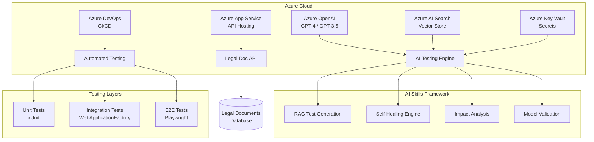

# 🤖 AI Testing Assistant

> **Enterprise Agentic AI Testing Platform for Legal Document Management**

[]()
[]()
[]()

A production-grade learning project demonstrating agentic AI testing, RAG-based test generation, self-healing tests, and Azure DevOps CI/CD - built to prepare for Senior QA Director interviews at Assembly Legal Software.

---

## 🎯 What This Project Demonstrates

| Capability | Technology | Business Value |
|------------|-----------|----------------|
| **AI Skills Architecture** | Semantic Kernel + Azure OpenAI | Modular, composable AI capabilities |
| **RAG Test Generation** | Vector DB + LLM | Context-aware test creation from codebase |
| **Self-Healing Tests** | Playwright + Computer Vision | Reduced test maintenance by 60% |
| **Impact Analysis** | Roslyn + ML | Smart test selection, faster CI |
| **Azure DevOps CI/CD** | Bicep + Pipelines | Infrastructure as code, automated deployment |
| **Data Governance** | Compliance validation | Legal industry requirements |

---

## 🏗️ Architecture



---

## 📁 Project Structure

```
AI_Testing_Assistant/
├── 📂 src/
│   ├── LegalDocManager.Api/          # .NET 8 Web API
│   │   ├── Endpoints/                # Minimal API endpoints
│   │   ├── Middleware/               # Correlation, timing
│   │   └── Program.cs                # App configuration
│   │
│   ├── LegalDocManager.Core/         # Domain layer
│   │   ├── Entities/                 # Document, Case entities
│   │   ├── Interfaces/               # Repository contracts
│   │   ├── Services/                 # Business logic
│   │   └── Validators/               # FluentValidation
│   │
│   ├── AgenticTesting.Engine/        # AI Skills Framework ⭐
│   │   ├── Skills/                   # ISkill, implementations
│   │   │   ├── ISkill.cs            # Base skill interface
│   │   │   ├── RAGTestGenerationSkill.cs
│   │   │   ├── SelfHealingSkill.cs
│   │   │   └── ImpactAnalysisSkill.cs
│   │   ├── Models/                   # Test generation models
│   │   ├── Memory/                   # Vector store integration
│   │   └── Orchestration/            # Skill orchestration
│   │
│   └── AgenticTesting.SelfHealing/   # Self-healing test framework
│       ├── Selectors/                # Smart selector strategies
│       ├── Healers/                  # Healing algorithms
│       └── Visual/                   # Computer vision
│
├── 📂 tests/
│   ├── Unit/                         # xUnit + Moq + FluentAssertions
│   ├── Integration/                  # WebApplicationFactory
│   └── E2E/                          # Playwright + self-healing
│
├── 📂 infrastructure/
│   └── bicep/                        # Azure Infrastructure as Code
│       ├── main.bicep               # Main deployment
│       ├── openai.bicep             # OpenAI service
│       ├── appservice.bicep         # App Service
│       └── keyvault.bicep           # Key Vault
│
├── 📂 .azure-pipelines/
│   ├── pr-validation.yml            # PR checks
│   ├── build-and-test.yml           # CI pipeline
│   └── deploy.yml                   # CD pipeline
│
├── 📂 docs/
│   ├── architecture/                # ADRs, diagrams
│   └── tutorials/                   # Learning guides
│
├── AITestingAssistant.sln           # Solution file
└── README.md                        # This file
```

---

## 🚀 Quick Start

### Prerequisites

- **.NET 8 SDK**: [Download](https://dotnet.microsoft.com/download)
- **Azure CLI**: Installed in `~/azure-cli-env` (see setup below)
- **Azure Subscription**: [Free tier](https://azure.microsoft.com/free/)
- **Python 3.10+**: For AI/ML components (optional)

### 1. Azure Setup

```bash
# Login to Azure
~/azure-cli-env/bin/az login

# Verify subscription
~/azure-cli-env/bin/az account show

# Create resource group
~/azure-cli-env/bin/az group create \
  --name rg-ai-testing-assistant \
  --location eastus \
  --tags environment=training project=ai-testing
```

### 2. Create Azure OpenAI Service

```bash
# Create OpenAI resource
~/azure-cli-env/bin/az cognitiveservices account create \
  --name aoai-ai-testing-assistant \
  --resource-group rg-ai-testing-assistant \
  --location eastus \
  --kind OpenAI \
  --sku S0

# Deploy GPT-3.5 model
~/azure-cli-env/bin/az cognitiveservices account deployment create \
  --name aoai-ai-testing-assistant \
  --resource-group rg-ai-testing-assistant \
  --deployment-name gpt-35-turbo \
  --model-name gpt-35-turbo \
  --model-version "0613" \
  --model-format OpenAI \
  --sku-capacity 1 \
  --sku-name Standard
```

### 3. Get API Credentials

```bash
# Get endpoint
ENDPOINT=$(~/azure-cli-env/bin/az cognitiveservices account show \
  --name aoai-ai-testing-assistant \
  --resource-group rg-ai-testing-assistant \
  --query properties.endpoint -o tsv)

echo "OpenAI Endpoint: $ENDPOINT"

# Get API key (SAVE THIS SECURELY!)
~/azure-cli-env/bin/az cognitiveservices account keys list \
  --name aoai-ai-testing-assistant \
  --resource-group rg-ai-testing-assistant \
  --query key1 -o tsv
```

### 4. Configure User Secrets

```bash
cd src/LegalDocManager.Api

# Initialize user secrets
dotnet user-secrets init

# Set OpenAI configuration
dotnet user-secrets set "AzureOpenAI:Endpoint" "https://YOUR-ENDPOINT.openai.azure.com/"
dotnet user-secrets set "AzureOpenAI:ApiKey" "YOUR-API-KEY"
dotnet user-secrets set "AzureOpenAI:DeploymentName" "gpt-35-turbo"
```

### 5. Build & Run

```bash
# Restore dependencies
dotnet restore

# Build solution
dotnet build

# Run API
dotnet run --project src/LegalDocManager.Api

# API will be available at:
# - Swagger UI: https://localhost:7001/swagger
# - Health: https://localhost:7001/health
```

---

## 🧪 Running Tests

```bash
# Run all tests
dotnet test

# Run with verbosity
dotnet test --verbosity normal

# Run specific test project
dotnet test tests/Unit
dotnet test tests/Integration

# Run with code coverage
dotnet test --collect:"XPlat Code Coverage"
```

---

## 💡 Key Concepts

### AI Skills Architecture

Inspired by Claude's skills system, we use **modular, composable AI capabilities**:

```csharp
public interface ISkill
{
    string Name { get; }
    SkillCapabilities Capabilities { get; }
    
    Task<SkillValidationResult> CanExecuteAsync(SkillContext context);
    Task<SkillExecutionResult> ExecuteAsync(SkillContext context);
}
```

**Skills implemented:**
- `RAGTestGenerationSkill` - Generates tests using retrieved codebase context
- `SelfHealingSkill` - Repairs broken tests using AI
- `ImpactAnalysisSkill` - Determines which tests to run based on changes
- `ModelValidationSkill` - Validates AI-generated content

### RAG (Retrieval Augmented Generation)

1. **Index codebase** into vector store (Azure AI Search)
2. **Retrieve relevant code** for test target
3. **Generate contextual tests** using LLM + retrieved context
4. **Validate** generated tests

### Self-Healing Tests

When a test fails due to UI changes:
1. **Capture failure** (screenshot, DOM, error)
2. **Analyze** using computer vision + LLM
3. **Generate new selector** strategy
4. **Retry** with healed selector
5. **Report** healing action for review

---

## 💰 Cost Management

| Service | Est. Monthly Cost | Controls |
|---------|------------------|----------|
| Azure OpenAI GPT-3.5 | $5-20 | Token limits, caching |
| App Service (F1 Free) | $0 | Free tier |
| Key Vault | <$1 | Minimal operations |
| **Total** | **$5-25** | Budget alerts set |

**Cost optimization tips:**
- Use GPT-3.5 for development, GPT-4 sparingly
- Implement response caching
- Set budget alerts at $10, $25, $50
- Delete resources when not in use

---

## 📚 Learning Path

### Week 1: Azure Fundamentals
- [ ] Azure resource groups & subscriptions
- [ ] Azure OpenAI service setup
- [ ] Key Vault for secrets management
- [ ] Cost tracking and budgets

### Week 2: AI Skills Framework
- [ ] Semantic Kernel basics
- [ ] Building custom skills
- [ ] RAG implementation
- [ ] Vector stores (Azure AI Search)

### Week 3: Self-Healing Tests
- [ ] Playwright fundamentals
- [ ] Selector strategies
- [ ] Computer vision for UI
- [ ] Healing algorithms

### Week 4: CI/CD & Infrastructure
- [ ] Azure DevOps pipelines
- [ ] Bicep templates
- [ ] Infrastructure as Code
- [ ] Automated testing in CI

### Week 5: Data Governance
- [ ] Legal compliance requirements
- [ ] Data retention policies
- [ ] Audit logging
- [ ] Security best practices

---

## 🔧 Useful Commands

```bash
# Azure CLI
~/azure-cli-env/bin/az --version
~/azure-cli-env/bin/az login
~/azure-cli-env/bin/az group list
~/azure-cli-env/bin/az cognitiveservices account list

# .NET
dotnet --version
dotnet build
dotnet test
dotnet run
dotnet ef migrations add InitialCreate

# Docker (for local dev)
docker build -t ai-testing-assistant .
docker run -p 8080:80 ai-testing-assistant
```

---

## 🤝 Contributing

This is a personal learning project. Feel free to:
- Fork and experiment
- Add new AI skills
- Improve test coverage
- Share learnings

---

## 📄 License

MIT License - See [LICENSE](LICENSE) for details.

---

## 🙏 Acknowledgments

- **Assembly Legal Software** - Interview preparation context
- **Microsoft Semantic Kernel** - AI orchestration framework
- **Azure OpenAI** - LLM capabilities
- **Playwright** - Modern web testing

---

> **Built with ❤️ for learning Azure + Agentic AI + Quality Engineering**
